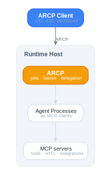
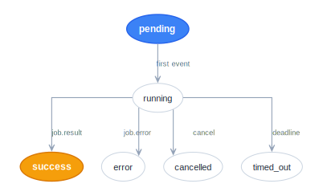

# Diagrams

Paired light/dark Graphviz diagrams for the ARCP specification. Edit the
`.dot` sources; render with `dot -Tsvg`.

## System architecture

<picture>
  <source media="(prefers-color-scheme: dark)" srcset="system-architecture-dark.svg">
  
</picture>

## Job lifecycle

<picture>
  <source media="(prefers-color-scheme: dark)" srcset="job-lifecycle-dark.svg">
  
</picture>

## Render

```sh
cd docs/diagrams
for f in *.dot; do dot -Tsvg "$f" -o "${f%.dot}.svg"; done
```

`graphviz` provides `dot`. On macOS: `brew install graphviz`. On
Debian/Ubuntu: `apt-get install -y graphviz`.
