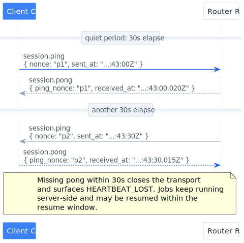
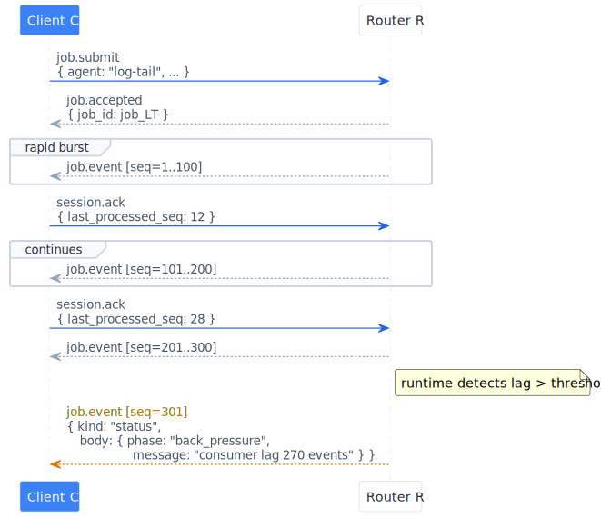
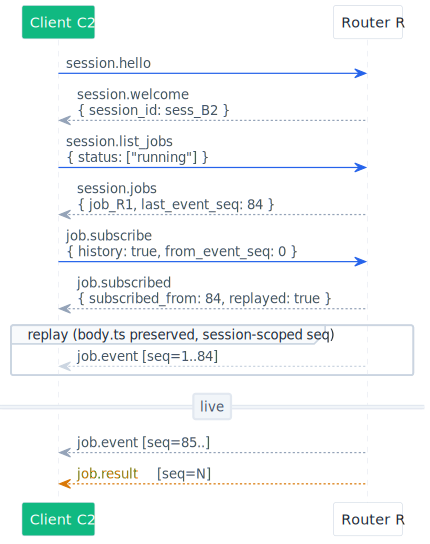
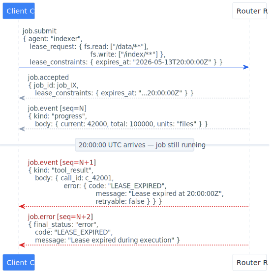
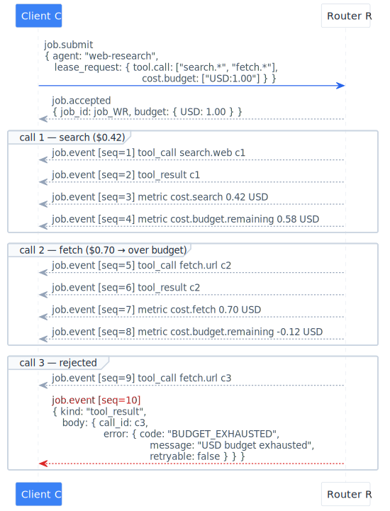
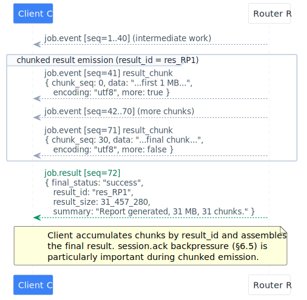
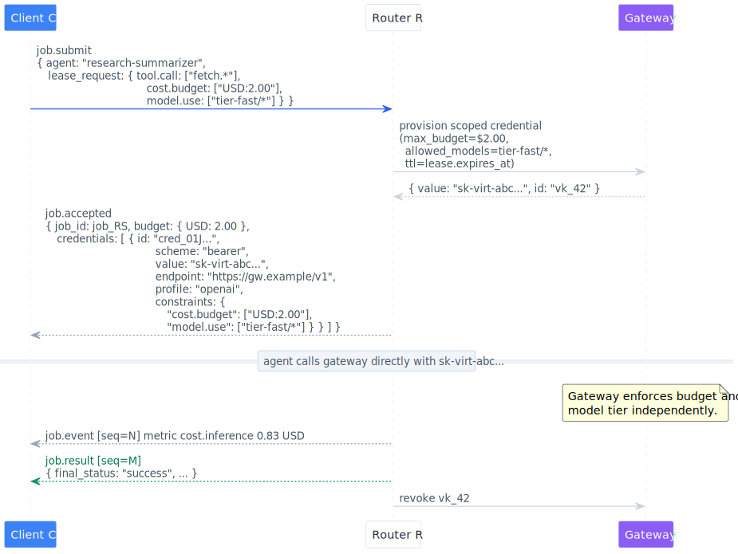
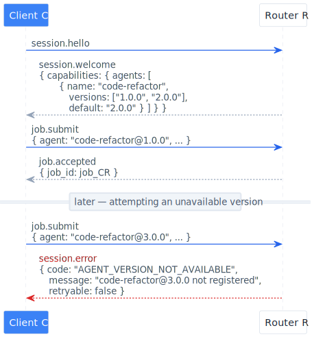

<style>
:root {
  --arcp-fg: #1f2328;
  --arcp-muted: #57606a;
  --arcp-border: #d0d7de;
  --arcp-bg-soft: #f6f8fa;
  --arcp-accent: #0969da;
  --arcp-accent-soft: #ddf4ff;
  --arcp-warn:rgb(245, 236, 165);
  --arcp-warn-soft:rgb(255, 242, 197);
  --arcp-danger: #cf222e;
  --arcp-danger-soft: #ffebe9;
}
@media (prefers-color-scheme: dark) {
  :root {
    --arcp-fg: #e6edf3;
    --arcp-muted:rgb(109, 112, 117);
    --arcp-border: #30363d;
    --arcp-bg-soft: #161b22;
    --arcp-accent: #58a6ff;
    --arcp-accent-soft: #0c2d6b;
    --arcp-warn:rgb(245, 236, 165);
    --arcp-warn-soft:rgb(255, 242, 197);
    --arcp-danger: #f85149;
    --arcp-danger-soft: #3c1618;
  }
}

.arcp-header {
  border: 1px solid var(--arcp-border);
  border-radius: 8px;
  padding: 1rem 1.25rem;
  margin: 1rem 0 1.5rem;
  background: var(--arcp-bg-soft);
  font-family: ui-monospace, SFMono-Regular, "SF Mono", Menlo, Consolas, monospace;
  font-size: 0.875rem;
  line-height: 1.5;
  color: var(--arcp-fg);
}
.arcp-header table {
  width: 100%;
  border-collapse: collapse;
  margin: 0;
}
.arcp-header td {
  border: 0;
  padding: 0.1rem 0;
  vertical-align: top;
}
.arcp-header td:first-child {
  color: var(--arcp-muted);
  width: 14rem;
  padding-right: 1rem;
}
.arcp-title {
  text-align: center;
  font-size: 1.05rem;
  font-weight: 600;
  margin: 0.75rem 0 0;
  padding-top: 0.75rem;
  border-top: 1px solid var(--arcp-border);
}

.arcp-callout {
  border-left: 4px solid var(--arcp-accent);
  background: var(--arcp-accent-soft);
  padding: 0.75rem 1rem;
  margin: 1rem 0;
  border-radius: 0 6px 6px 0;
}
.arcp-callout--warn {
  border-left-color: var(--arcp-warn);
  background: var(--arcp-warn-soft);
  color: #000
}
.arcp-callout--note {
  border-left-color: var(--arcp-muted);
  background: var(--arcp-bg-soft);
}
.arcp-callout > .arcp-callout-title {
  font-weight: 600;
  margin: 0 0 0.25rem;
  text-transform: uppercase;
  font-size: 0.75rem;
  letter-spacing: 0.05em;
  color: var(--arcp-muted);
}

.arcp-badge {
  display: inline-block;
  font-family: ui-monospace, SFMono-Regular, "SF Mono", Menlo, Consolas, monospace;
  font-size: 0.75rem;
  padding: 0.1rem 0.5rem;
  border-radius: 999px;
  background: var(--arcp-accent-soft);
  color: var(--arcp-accent);
  border: 1px solid var(--arcp-border);
  font-weight: 600;
  vertical-align: middle;
  letter-spacing: 0.02em;
}
.arcp-feature {
  margin: 0.5rem 0 1rem;
  font-size: 0.9rem;
  color: var(--arcp-muted);
}

dl.arcp-terms {
  margin: 0;
  padding: 0;
}
dl.arcp-terms > dt {
  font-weight: 600;
  margin-top: 0.75rem;
  color: var(--arcp-fg);
}
dl.arcp-terms > dd {
  margin: 0.15rem 0 0 0;
  color: var(--arcp-fg);
}

.toc ol {
  list-style: none;
  padding-left: 1.25rem;
}
.toc > li {
  margin: 0.15rem 0;
}
.toc li::marker {
  content: counters(list-item, ".") ". ";
  color: var(--arcp-muted);
  font-variant-numeric: tabular-nums;
}
.toc a {
  text-decoration: none;
}
.toc a:hover {
  text-decoration: underline;
}

.arcp-table {
  border-collapse: collapse;
  width: 100%;
  margin: 1rem 0;
  font-size: 0.9rem;
}
.arcp-table th,
.arcp-table td {
  border: 1px solid var(--arcp-border);
  padding: 0.5rem 0.75rem;
  text-align: left;
  vertical-align: top;
}
.arcp-table thead th {
  background: var(--arcp-bg-soft);
  font-weight: 600;
}
.arcp-table tbody tr:nth-child(2n) {
  background: var(--arcp-bg-soft);
}
.arcp-table code {
  white-space: nowrap;
}
</style>

# ARCP: Agent Runtime Control Protocol

<div class="arcp-header">
  <table>
    <tr><td>Internet-Draft</td><td>Nick Ficano</td></tr>
    <tr><td>Intended status</td><td>Standards Track</td></tr>
    <tr><td>Expires</td><td>November 13, 2026</td></tr>
    <tr><td>Date</td><td>May 13, 2026</td></tr>
  </table>
  <div class="arcp-title">Agent Runtime Control Protocol (ARCP) — Version 1.1</div>
</div>

## Status of This Memo

This document is a draft specification distributed for review and
discussion. Implementations are encouraged but should expect breaking
changes before v1.1 is finalized.

Distribution of this memo is unlimited.

## Abstract

The Agent Runtime Control Protocol (ARCP) is a transport-agnostic
wire protocol for submitting, observing, and controlling long-running
AI agent jobs. ARCP provides explicit liveness signaling, event
acknowledgement and flow control, job introspection, cross-session job
subscription, agent versioning, time-bounded leases, budget
enforcement, lease-bound provisioned credentials, structured progress
reporting, and streamed results — all within the four concerns of
**identity**, **durability**, **authority**, and **observability**.

## Deferred

The following are out of scope for this version:

- Job pause/unpause.
- Job priority and scheduling hints.
- Federation across runtimes.
- Streaming-token surface for LLM outputs.

## Table of Contents

<ol class="toc">
  <li><a href="#1-introduction">Introduction</a></li>
  <li><a href="#2-conventions">Conventions</a></li>
  <li><a href="#3-protocol-overview">Protocol Overview</a></li>
  <li><a href="#4-transport">Transport</a></li>
  <li><a href="#5-wire-format">Wire Format</a></li>
  <li>
    <a href="#6-sessions">Sessions</a>
    <ol>
      <li><a href="#61-authentication">Authentication</a></li>
      <li><a href="#62-hello--welcome">Hello / Welcome</a></li>
      <li><a href="#63-resume">Resume</a></li>
      <li><a href="#64-heartbeats">Heartbeats</a></li>
      <li><a href="#65-event-acknowledgement">Event Acknowledgement</a></li>
      <li><a href="#66-job-listing">Job Listing</a></li>
      <li><a href="#67-close">Close</a></li>
    </ol>
  </li>
  <li>
    <a href="#7-jobs">Jobs</a>
    <ol>
      <li><a href="#71-submission-and-acceptance">Submission and Acceptance</a></li>
      <li><a href="#72-idempotency">Idempotency</a></li>
      <li><a href="#73-lifecycle">Lifecycle</a></li>
      <li><a href="#74-cancellation">Cancellation</a></li>
      <li><a href="#75-agent-versioning">Agent Versioning</a></li>
      <li><a href="#76-subscription">Subscription</a></li>
    </ol>
  </li>
  <li>
    <a href="#8-job-events">Job Events</a>
    <ol>
      <li><a href="#81-event-envelope">Event Envelope</a></li>
      <li><a href="#82-event-kinds">Event Kinds</a></li>
      <li><a href="#83-ordering-and-sequence-numbers">Ordering and Sequence Numbers</a></li>
      <li><a href="#84-result-streaming">Result Streaming</a></li>
    </ol>
  </li>
  <li>
    <a href="#9-leases">Leases</a>
    <ol>
      <li><a href="#91-capability-model">Capability Model</a></li>
      <li><a href="#92-lease-grammar">Lease Grammar</a></li>
      <li><a href="#93-enforcement">Enforcement</a></li>
      <li><a href="#94-lease-subsetting">Lease Subsetting</a></li>
      <li><a href="#95-lease-expiration">Lease Expiration</a></li>
      <li><a href="#96-budget-capability">Budget Capability</a></li>
      <li><a href="#97-model-capability">Model Capability</a></li>
      <li><a href="#98-provisioned-credentials">Provisioned Credentials</a></li>
    </ol>
  </li>
  <li><a href="#10-delegation">Delegation</a></li>
  <li><a href="#11-trace-propagation">Trace Propagation</a></li>
  <li><a href="#12-error-taxonomy">Error Taxonomy</a></li>
  <li><a href="#13-examples">Examples</a></li>
  <li><a href="#14-security-considerations">Security Considerations</a></li>
  <li><a href="#15-iana-considerations">IANA Considerations</a></li>
  <li><a href="#16-references">References</a></li>
</ol>

---

## 1. Introduction

ARCP defines the durable execution envelope around AI agent work —
sessions, jobs, resumable event streams, capability-bounded leases,
and delegation — while remaining agnostic about agent implementation
and tool transport. Tool exposure is the concern of protocols such
as MCP. Telemetry export is the concern of OpenTelemetry. ARCP
composes with them.

### 1.1. Scope

ARCP specifies:

- The wire format for client-runtime communication.
- The lifecycle of sessions, jobs, and event streams.
- The authority model (leases) with time and budget bounds.
- The mechanics of delegation, subscription, and introspection.
- Trace context propagation rules.

### 1.2. Non-Goals

ARCP does NOT specify how agents are implemented, how tools are
exposed, how HITL is surfaced, how agent state persists across
process restarts, telemetry export formats, scheduling or priority
semantics, pause/resume of running jobs, or authentication
mechanisms beyond bearer tokens.

### 1.3. Relationship to Other Protocols

ARCP wraps the agent function; MCP exposes tools the agent calls;
the LLM SDK powers the agent's reasoning loop.

---

## 2. Conventions

### 2.1. Requirements Language

The key words "MUST", "MUST NOT", "REQUIRED", "SHALL", "SHALL NOT",
"SHOULD", "SHOULD NOT", "RECOMMENDED", "MAY", and "OPTIONAL" in this
document are to be interpreted as described in [RFC2119] and
[RFC8174].

### 2.2. Terminology

<dl class="arcp-terms">
  <dt>Budget counter</dt>
  <dd>A runtime-maintained accumulator associated with a
  <code>cost.budget</code> capability that decrements as
  cost-bearing metrics are reported.</dd>
  <dt>Subscriber</dt>
  <dd>A client that has attached to an existing job via
  <code>job.subscribe</code> rather than submitting it.</dd>
  <dt>Heartbeat interval</dt>
  <dd>The period (in seconds) within which each peer SHOULD send at
  least one message, or a <code>session.ping</code> if idle.</dd>
</dl>

---

## 3. Protocol Overview

A typical ARCP interaction proceeds as follows:

1. Client opens transport.
2. `session.hello` declares client identity, auth, and feature
   capabilities. `session.welcome` responds with `session_id`,
   `resume_token`, `heartbeat_interval_sec`, and runtime capabilities
   including an agent inventory with versions.
3. Either peer MAY emit `session.ping` if idle and expect a prompt
   `session.pong`. Either peer MAY treat extended absence as
   `HEARTBEAT_LOST`.
4. Client MAY periodically send `session.ack` declaring its
   highest-processed `event_seq`. The runtime MAY use this to free
   buffered events earlier than the time-based window.
5. Client submits `job.submit` (optionally with `lease_constraints`
   like `expires_at`). Runtime returns `job.accepted` with the
   effective lease and any budget counters initialized.
6. Runtime emits `job.event` messages. `progress` and `result_chunk`
   event kinds provide structured progress and large-output streaming.
7. The client MAY at any time send `session.list_jobs` for a
   read-only inventory of jobs in this session, or `job.subscribe`
   to attach to a job started in another session.
8. The job terminates with `job.result` or `job.error`. If the
   result was chunked, `job.result.payload.result_id` references
   the assembled chunks.
9. Resume, cancel, and close follow the session and job lifecycle
   described in §§6–7.

---

## 4. Transport

WebSocket is mandatory for network deployments. stdio is mandatory
for in-process children. HTTP/2, QUIC, and message-queue transports
are optional.

---

## 5. Wire Format

The wire format is a JSON object envelope with `arcp`, `id`, `type`,
`session_id`, `trace_id`, `job_id`, `event_seq`, and `payload`
fields.

Implementations MUST ignore unknown top-level envelope fields,
ensuring forward compatibility as the protocol evolves.

---

## 6. Sessions

### 6.1. Authentication

Authentication uses a bearer token passed in
`session.hello.payload.auth.token`.

### 6.2. Hello / Welcome

`session.hello` carries a `features` capability list so the runtime
can detect what the client supports and adapt:

```json
{
  "type": "session.hello",
  "payload": {
    "client": { "name": "examplectl", "version": "0.4.1" },
    "auth": { "scheme": "bearer", "token": "..." },
    "capabilities": {
      "encodings": ["json"],
      "features": [
        "heartbeat",
        "ack",
        "list_jobs",
        "subscribe",
        "lease_expires_at",
        "cost.budget",
        "model.use",
        "provisioned_credentials",
        "progress",
        "result_chunk",
        "agent_versions"
      ]
    }
  }
}
```

`session.welcome` responds with feature acknowledgement, an agent
inventory enriched with version information, and a heartbeat
interval:

```json
{
  "type": "session.welcome",
  "session_id": "sess_01J...",
  "payload": {
    "runtime": { "name": "example-runtime", "version": "1.1.0" },
    "resume_token": "rt_4f8c...",
    "resume_window_sec": 600,
    "heartbeat_interval_sec": 30,
    "capabilities": {
      "encodings": ["json"],
      "features": [
        "heartbeat",
        "ack",
        "list_jobs",
        "subscribe",
        "lease_expires_at",
        "cost.budget",
        "model.use",
        "provisioned_credentials",
        "progress",
        "result_chunk",
        "agent_versions"
      ],
      "agents": [
        {
          "name": "code-refactor",
          "versions": ["1.0.0", "2.0.0"],
          "default": "2.0.0"
        },
        { "name": "test-runner", "versions": ["1.0.0"], "default": "1.0.0" },
        { "name": "report-builder", "versions": ["0.9.0"], "default": "0.9.0" }
      ]
    }
  }
}
```

The effective feature set is the intersection of `session.hello`
features and `session.welcome` features. Either peer MUST NOT use a
feature outside that intersection.

### 6.3. Resume

The resume token rotates on every successful welcome. A client
reconnecting after a transport drop presents `last_event_seq` and
its most recent `resume_token` in `session.resume`. The runtime
replays buffered events from that sequence. `RESUME_WINDOW_EXPIRED`
is returned if the buffer no longer covers the requested
`last_event_seq`.

### 6.4. Heartbeats

<p class="arcp-feature">Feature flag: <span class="arcp-badge">heartbeat</span></p>

When negotiated, both peers SHOULD ensure at least one message
flows in each direction per `heartbeat_interval_sec`. An idle peer
sends `session.ping`:

```json
{
  "type": "session.ping",
  "session_id": "sess_...",
  "payload": {
    "nonce": "p_01J...",
    "sent_at": "2026-05-13T19:42:13.000Z"
  }
}
```

The receiver MUST respond promptly (within
`heartbeat_interval_sec`) with `session.pong`:

```json
{
  "type": "session.pong",
  "session_id": "sess_...",
  "payload": {
    "ping_nonce": "p_01J...",
    "received_at": "2026-05-13T19:42:13.020Z"
  }
}
```

A peer that observes no messages (of any kind) from its counterpart
for two consecutive intervals MAY treat the connection as dead,
close the transport, and surface `HEARTBEAT_LOST`. The runtime
MUST NOT terminate jobs on heartbeat loss; the session continues
to exist for the resume window.

Heartbeats are NOT included in `event_seq`. They are session
control messages, not job events.

### 6.5. Event Acknowledgement

<p class="arcp-feature">Feature flag: <span class="arcp-badge">ack</span></p>

The client MAY periodically inform the runtime of its highest
processed event sequence:

```json
{
  "type": "session.ack",
  "session_id": "sess_...",
  "payload": { "last_processed_seq": 1827 }
}
```

The runtime:

- MAY free buffered events with `seq ≤ last_processed_seq` earlier
  than the time-based resume window would.
- MUST NOT free events the client has not yet acknowledged, even if
  the resume window has elapsed, unless memory or buffer-count
  limits force eviction.
- MAY use the lag between the latest emitted seq and
  `last_processed_seq` to detect slow consumers and emit
  implementation-defined back-pressure signals (e.g., a `status`
  event with `phase: "back_pressure"`).

Clients SHOULD send `session.ack` at most every event or every few
hundred milliseconds, whichever is less frequent. `session.ack`
messages are not included in `event_seq`.

`session.ack` is purely advisory. Resume continues to require the
client to present `last_event_seq` independently; the runtime does
not assume an unacknowledged event is unreceived.

### 6.6. Job Listing

<p class="arcp-feature">Feature flag: <span class="arcp-badge">list_jobs</span></p>

A client MAY request a read-only inventory of jobs accessible in
the current session:

```json
{
  "type": "session.list_jobs",
  "session_id": "sess_...",
  "id": "01J...",
  "payload": {
    "filter": {
      "status": ["running", "pending"],
      "agent": "code-refactor",
      "created_after": "2026-05-13T00:00:00Z"
    },
    "limit": 100,
    "cursor": null
  }
}
```

All `filter` fields are optional. The runtime responds:

```json
{
  "type": "session.jobs",
  "session_id": "sess_...",
  "payload": {
    "request_id": "01J...",
    "jobs": [
      {
        "job_id": "job_01JABC...",
        "agent": "code-refactor@2.0.0",
        "status": "running",
        "lease": {
          /* effective lease */
        },
        "parent_job_id": null,
        "created_at": "2026-05-13T19:30:00Z",
        "trace_id": "4bf92f...",
        "last_event_seq": 1822
      }
    ],
    "next_cursor": null
  }
}
```

Scope: the runtime returns jobs the session's authenticated
principal is permitted to observe. Typically: jobs submitted by
this principal. The runtime MAY include jobs from other principals
if deployment policy permits. Implementations MUST NOT leak job
existence across principals not authorized to know about them.

`session.list_jobs` does not subscribe to events. To receive future
events for a listed job, use `job.subscribe` (§7.6).

### 6.7. Close

The client sends `session.close` to terminate the session gracefully.
The runtime acknowledges with `session.closed`. In-flight jobs are
not affected; they continue running and remain resumable within the
resume window.

---

## 7. Jobs

### 7.1. Submission and Acceptance

`job.submit` carries optional `lease_constraints`:

```json
{
  "type": "job.submit",
  "session_id": "sess_...",
  "trace_id":   "4bf92f...",
  "payload": {
    "agent": "code-refactor@2.0.0",
    "input": { ... },
    "lease_request": {
      "fs.read":     ["/workspace/myapp/**"],
      "fs.write":    ["/workspace/myapp/src/**"],
      "cost.budget": ["USD:5.00"],
      "model.use":   ["tier-fast/*"]
    },
    "lease_constraints": {
      "expires_at": "2026-05-13T23:42:00Z"
    },
    "idempotency_key": "refactor-auth-2026-W19",
    "max_runtime_sec": 1800
  }
}
```

`job.accepted` echoes the effective lease and constraints, plus
initial budget counters if `cost.budget` is in the lease:

```json
{
  "type": "job.accepted",
  "session_id": "sess_...",
  "payload": {
    "job_id": "job_01JABC...",
    "lease": {
      /* effective */
    },
    "lease_constraints": { "expires_at": "2026-05-13T23:42:00Z" },
    "budget": { "USD": 5.0 },
    "credentials": [
      {
        "id": "cred_01J...",
        "scheme": "bearer",
        "value": "sk-virt-...",
        "endpoint": "https://gateway.example.com/v1",
        "profile": "openai",
        "constraints": {
          "cost.budget": ["USD:5.00"],
          "model.use":   ["tier-fast/*"],
          "expires_at":  "2026-05-13T23:42:00Z"
        }
      }
    ],
    "accepted_at": "2026-05-13T19:30:00Z",
    "trace_id": "4bf92f..."
  }
}
```

If `lease_constraints` is absent the lease has no expiration. If
`cost.budget` is absent from the lease, no budget enforcement
applies. The `credentials` array is OPTIONAL and governed by §9.8.

### 7.2. Idempotency

If `idempotency_key` is present on `job.submit`, the runtime MUST
return the same `job.accepted` payload for any subsequent submission
with the same key and identical parameters. A reused key with
conflicting parameters returns `DUPLICATE_KEY`.

### 7.3. Lifecycle

Terminal states are `success`, `error`, `cancelled`, and
`timed_out`. `BUDGET_EXHAUSTED` and `LEASE_EXPIRED` errors both
result in `final_status: "error"`.

### 7.4. Cancellation

The submitting session MAY send `job.cancel` at any time for a
non-terminal job. The runtime acknowledges with `job.cancelled` and
emits `job.error` with code `CANCELLED` and `final_status:
"cancelled"`.

### 7.5. Agent Versioning

<p class="arcp-feature">Feature flag: <span class="arcp-badge">agent_versions</span></p>

The `agent` field of `job.submit.payload` MAY include a version
suffix:

```
agent ::= name | name "@" version
name  ::= [a-z0-9][a-z0-9._-]*
version ::= [a-zA-Z0-9.+_-]+
```

Resolution rules:

- A bare `name` resolves to the `default` version advertised in
  `session.welcome.payload.capabilities.agents`. If no `default` is
  advertised, the runtime MAY pick any registered version; clients
  that require stability MUST pin a version explicitly.
- `name@version` requests an exact version. If unavailable, the
  runtime returns `AGENT_VERSION_NOT_AVAILABLE`.
- Versions are opaque strings to the protocol; the runtime MAY
  define ordering semantics (e.g., SemVer) but ARCP does not
  prescribe one.

The resolved version appears in `job.accepted.payload` and in
listings as `agent: "name@version"`. Once resolved, a job's agent
version is fixed; the runtime MUST NOT migrate a running job to a
different version.

### 7.6. Subscription

<p class="arcp-feature">Feature flag: <span class="arcp-badge">subscribe</span></p>

A client MAY attach to a job that was submitted in a different
session or earlier in the same session, receiving the live event
stream and (optionally) replay of buffered history:

```json
{
  "type": "job.subscribe",
  "session_id": "sess_...",
  "payload": {
    "job_id": "job_01JABC...",
    "from_event_seq": 0,
    "history": true
  }
}
```

Fields:

- `job_id` (REQUIRED): The job to attach to.
- `from_event_seq` (OPTIONAL, default = "live"): If specified
  along with `history: true`, the runtime replays buffered events
  with `seq > from_event_seq` before resuming live streaming.
  Bounded by the same buffer window that governs resume.
- `history` (OPTIONAL, default `false`): Whether to replay
  buffered history. If `false`, the client only sees events
  emitted after subscription is acknowledged.

The runtime responds:

```json
{
  "type": "job.subscribed",
  "session_id": "sess_...",
  "payload": {
    "job_id":          "job_01JABC...",
    "current_status":  "running",
    "agent":           "code-refactor@2.0.0",
    "lease":           { ... },
    "parent_job_id":   null,
    "trace_id":        "4bf92f...",
    "subscribed_from": 1830,
    "replayed":        false
  }
}
```

After subscription, `job.event` messages for the subscribed job
appear in the session's stream interleaved with other jobs' events,
using the session's normal `event_seq` space.

Authorization: the runtime MUST verify the subscribing session's
principal is permitted to observe the target job. Principals that
submitted the job are always permitted. Other principals are
governed by deployment policy. Unauthorized subscription returns
`PERMISSION_DENIED`.

A subscriber MAY cancel a subscription:

```json
{
  "type": "job.unsubscribe",
  "session_id": "sess_...",
  "payload": { "job_id": "job_01JABC..." }
}
```

Subscription does NOT grant the subscriber authority to cancel the
job, mutate its lease, or interact with it beyond observation.
Cancellation is reserved for the session that submitted the job.

### 7.7. Subscribed Jobs vs Resumed Sessions

Subscription and resume are distinct mechanisms:

| Property                  | Resume           | Subscribe               |
| ------------------------- | ---------------- | ----------------------- |
| Same session continues    | Yes              | No (new session)        |
| Replays buffered events   | Mandatory        | Optional                |
| Carries cancel authority  | Yes              | No                      |
| Requires `resume_token`   | Yes              | No                      |
| Available across machines | No (one session) | Yes (multiple sessions) |

Implementations of dashboards or auditors SHOULD use subscribe.
Implementations of agent CLIs reconnecting after a network drop
SHOULD use resume.

---

## 8. Job Events

### 8.1. Event Envelope

Each event is a JSON object with `type`, `session_id`, `job_id`,
`event_seq`, and `payload` fields. The `payload` carries a `kind`
discriminator and a `body` object whose shape is kind-specific.

### 8.2. Event Kinds

The following event `kind` values are defined:

| kind           | body shape                                   |
| -------------- | -------------------------------------------- |
| `log`          | `{ level, message }`                         |
| `thought`      | `{ text }`                                   |
| `tool_call`    | `{ tool, args, call_id }`                    |
| `tool_result`  | `{ call_id, result \| error }`               |
| `status`       | `{ phase, message? }`                        |
| `metric`       | `{ name, value, unit?, dimensions? }`        |
| `artifact_ref` | `{ uri, content_type, byte_size?, sha256? }` |
| `delegate`     | (see §10)                                    |
| `progress`     | `{ current, total?, units?, message? }`      |
| `result_chunk` | (see §8.4)                                   |

#### 8.2.1. `progress` body

```json
{
  "kind": "progress",
  "ts": "2026-05-13T19:42:13Z",
  "body": {
    "current": 47,
    "total": 120,
    "units": "files",
    "message": "Refactoring src/auth/middleware.ts"
  }
}
```

`total` is OPTIONAL; absent means indeterminate. `units` and
`message` are OPTIONAL. `current` MUST be a non-negative number.
If `total` is present, `current` SHOULD be ≤ `total`.

The protocol does not act on progress events; they are advisory
for clients rendering progress UI.

### 8.3. Ordering and Sequence Numbers

Sequence numbers are session-scoped, strictly monotonic, and
gap-free across reconnects within the buffer window. A client that
receives an unexpected gap SHOULD treat the session as broken and
attempt resume.

### 8.4. Result Streaming

<p class="arcp-feature">Feature flag: <span class="arcp-badge">result_chunk</span></p>

For jobs that produce large final results, the agent MAY stream
the result as a sequence of `result_chunk` events terminated by a
normal `job.result`:

```json
{
  "kind": "result_chunk",
  "ts": "2026-05-13T19:50:00Z",
  "body": {
    "result_id": "res_01J...",
    "chunk_seq": 0,
    "data": "<base64-encoded bytes or text fragment>",
    "encoding": "utf8",
    "more": true
  }
}
```

Fields:

- `result_id` (REQUIRED): Stable identifier for the assembled
  result, generated by the runtime when the agent begins
  streaming.
- `chunk_seq` (REQUIRED): 0-based monotonic chunk index per
  `result_id`. The chunks for one `result_id` MUST be emitted in
  order.
- `data` (REQUIRED): Chunk payload. Encoding is governed by
  `encoding`.
- `encoding` (REQUIRED): One of `utf8`, `base64`. `utf8` SHOULD be
  used for text; `base64` for binary.
- `more` (REQUIRED): `true` if additional chunks follow; `false`
  on the final chunk.

The terminating `job.result` references the streamed result:

```json
{
  "type": "job.result",
  "session_id": "sess_...",
  "job_id": "job_...",
  "event_seq": 4827,
  "payload": {
    "final_status": "success",
    "result_id": "res_01J...",
    "result_size": 31_457_280,
    "summary": "Generated report in 137 chunks."
  }
}
```

When `result_id` is present, the assembled result is the
concatenation of the chunks' decoded `data` in `chunk_seq` order.
When `result_id` is absent, the result is inline in the payload.

Implementations MUST NOT mix inline result and `result_chunk` in
the same job. Once a `result_chunk` is emitted, the terminating
`job.result` MUST carry `result_id`.

---

## 9. Leases

### 9.1. Capability Model

A lease is a set of capability grants expressed as namespace/pattern
pairs. Every authority-bearing operation performed by an agent MUST
be covered by a capability in the job's effective lease. The runtime
enforces the lease at every operation boundary.

### 9.2. Lease Grammar

Capability patterns are namespace-prefixed glob strings. Reserved
top-level namespaces:

| Namespace        | Semantics                                                |
| ---------------- | -------------------------------------------------------- |
| `fs.read`        | Filesystem read; patterns are path globs.                |
| `fs.write`       | Filesystem write; patterns are path globs.               |
| `net.fetch`      | Outbound HTTP/HTTPS; patterns are URL globs.             |
| `tool.call`      | Calling registered tools; patterns are tool name globs.  |
| `agent.delegate` | Delegating to sub-agents; patterns are agent name globs. |
| `cost.budget`    | Cost ceilings; patterns are amount strings (§9.6).       |
| `model.use`      | LLM model selection; patterns are model name globs (§9.7). |

### 9.3. Enforcement

The runtime MUST evaluate the effective lease before authorizing any
operation. An operation not covered by the lease MUST fail with
`PERMISSION_DENIED`. Enforcement is synchronous and occurs before
the operation is dispatched.

### 9.4. Lease Subsetting

A delegated lease MUST be a strict subset of the delegating lease.
No delegated grant may name a resource or capability the parent
lease does not cover. Delegation that would expand authority is
rejected with `LEASE_SUBSET_VIOLATION`.

A delegated lease's `cost.budget` MUST NOT exceed the parent's
remaining budget in any currency at the time of delegation. If
the parent's lease has `cost.budget: ["USD:5.00"]` and has spent
$3.00, a child's `cost.budget` MUST NOT exceed `USD:2.00`.

A delegated lease's `lease_constraints.expires_at`, if present,
MUST NOT exceed the parent's `expires_at`. A child MAY have an
earlier expiration than its parent; it MUST NOT have a later one.

A delegated lease MAY omit `lease_constraints` if the parent had
none; if the parent had `expires_at`, the child inherits it
implicitly (i.e., the child's effective expiration is `min(child
expires_at, parent expires_at)`).

A delegated lease's `model.use` patterns MUST resolve to a set of
permitted models that is a subset of the parent's permitted set.
A child that names a model the parent does not cover is rejected
with `LEASE_SUBSET_VIOLATION`.

### 9.5. Lease Expiration

<p class="arcp-feature">Feature flag: <span class="arcp-badge">lease_expires_at</span></p>

A job's lease MAY carry an `expires_at` timestamp via
`lease_constraints`:

```json
"lease_constraints": {
  "expires_at": "2026-05-13T23:42:00Z"
}
```

`expires_at` is ISO 8601 with timezone, MUST be UTC (`Z` suffix),
and MUST be in the future at submission time. Past or invalid
values are rejected with `INVALID_REQUEST`.

Enforcement:

- The runtime MUST evaluate `expires_at` on every operation against
  the lease.
- Operations attempted at or after `expires_at` MUST fail with
  `LEASE_EXPIRED`. The error is surfaced via the normal mechanism
  (e.g., as a `tool_result` event with the error code).
- The runtime MUST emit `job.error` with code `LEASE_EXPIRED` and
  `final_status: "error"` if the job is still active when its
  lease expires and the agent attempts any further authority-bearing
  operation. The runtime MAY proactively terminate jobs whose leases
  have expired without waiting for a violation.

Renewal is NOT supported. To extend authority, the submitting
client MUST cancel and resubmit.

### 9.6. Budget Capability

<p class="arcp-feature">Feature flag: <span class="arcp-badge">cost.budget</span></p>

The `cost.budget` capability declares an upper bound on cumulative
cost for the job. Patterns are amount strings of the form:

```
amount ::= currency ":" decimal
currency ::= "USD" | "EUR" | "credits" | <runtime-defined>
decimal ::= digits ( "." digits )?
```

Example:

```json
"cost.budget": ["USD:5.00", "credits:1000"]
```

Multiple currencies are tracked independently. Each is a separate
counter, initialized at the budgeted value at job acceptance.

Cost is reported by the agent via `metric` events whose `name`
begins with `cost.` and whose `unit` matches a budgeted currency:

```json
{
  "kind": "metric",
  "body": {
    "name": "cost.inference",
    "value": 0.0234,
    "unit": "USD"
  }
}
```

The runtime MUST decrement the matching counter by `value` on
each such metric event. Negative values are rejected and produce
no decrement.

Enforcement:

- The runtime MUST check all budget counters before authorizing
  any operation through the lease (any `tool.call`, `fs.*`,
  `net.fetch`, `agent.delegate`).
- If any counter is ≤ 0, the operation MUST fail with
  `BUDGET_EXHAUSTED`. The error MAY appear as a `tool_result`
  error (allowing the agent to handle it) or as `job.error` with
  `final_status: "error"` (if the runtime treats exhaustion as
  fatal). Runtimes SHOULD prefer the `tool_result` form so the
  agent can decide whether to continue with non-cost-bearing
  operations.
- Cost reporting is the agent's (and tool authors') responsibility.
  Unreported costs are not enforced. The protocol does not predict
  cost ahead of operation.

Current budget state appears in `job.event` `metric` payloads
optionally:

```json
{
  "kind": "metric",
  "body": {
    "name": "cost.budget.remaining",
    "value": 1.42,
    "unit": "USD"
  }
}
```

Runtimes MAY emit these `cost.budget.remaining` metrics
proactively after material decrements, allowing clients to render
budget gauges without summing every cost event.

When a `cost.budget` capability is enforced through a provisioned
credential (§9.8), the upstream is the authoritative budget
counter for that currency and `BUDGET_EXHAUSTED` MAY first surface
as a vendor-specific error from the upstream. Runtimes SHOULD
translate such upstream errors into `BUDGET_EXHAUSTED` at the
ARCP boundary and SHOULD continue to emit
`cost.budget.remaining` metrics so clients see consistent budget
telemetry regardless of which layer is enforcing.

### 9.7. Model Capability

<p class="arcp-feature">Feature flag: <span class="arcp-badge">model.use</span></p>

The `model.use` capability declares the set of LLM models the
agent is authorized to invoke. Patterns are model-name globs
opaque to the protocol; deployment policy defines the namespace
(e.g., raw vendor model IDs like `gpt-4o-2024-08-06`, vendor-
prefixed IDs like `anthropic/claude-3-opus-*`, or runtime-defined
tiers like `tier-fast/*`).

Example:

```json
"model.use": ["tier-fast/*", "anthropic/claude-3-haiku-*"]
```

Enforcement:

- The runtime MUST reject any agent attempt to invoke a model
  whose identifier does not match at least one pattern. The
  rejection MUST surface as `PERMISSION_DENIED`.
- When model invocation is mediated by a provisioned credential
  (§9.8), the runtime SHOULD bake the same constraint into the
  credential so the upstream enforces it independently. Both
  layers enforcing is intentional defense-in-depth, not a
  contradiction.
- Absence of `model.use` from the lease grants no implicit model
  access. A lease that does not name `model.use` MUST be treated
  as forbidding LLM invocation when the runtime is configured to
  require it; otherwise the runtime MAY allow any registered
  model. Deployment policy decides which default applies.

### 9.8. Provisioned Credentials

<p class="arcp-feature">Feature flag: <span class="arcp-badge">provisioned_credentials</span></p>

The runtime MAY provision short-lived credentials to upstream
cost-bearing services (LLM gateways, search APIs, paid SaaS) on
behalf of a job, with each credential pre-constrained to match the
job's lease. The credential becomes the enforcement boundary at
the upstream, replacing reliance on agent self-reporting for
`cost.budget`, `model.use`, and similar capabilities.

The mechanism is vendor-neutral: any upstream that can mint a
scoped credential — LiteLLM virtual keys, vendor-issued sub-keys,
short-lived OAuth tokens, signed URLs — is a valid backend. The
wire shape below is uniform across vendors; vendor-specific
provisioning is a runtime concern not visible on the wire.

#### 9.8.1. Wire Shape

When advertised, `job.accepted.payload.credentials` is an array of
credential objects:

```json
{
  "id": "cred_01J...",
  "scheme": "bearer",
  "value": "sk-virt-...",
  "endpoint": "https://gateway.example.com/v1",
  "profile": "openai",
  "constraints": {
    "cost.budget": ["USD:5.00"],
    "model.use":   ["tier-fast/*"],
    "expires_at":  "2026-05-13T23:42:00Z"
  }
}
```

Fields:

- `id` (REQUIRED): Stable identifier for the credential within
  the job. Used for audit, rotation, and revocation correlation.
- `scheme` (REQUIRED): Authentication scheme. `bearer` is the
  only scheme defined by this specification. Implementations MAY
  define others (e.g., `basic`, `signed_url`); unknown schemes
  MUST be ignored by clients that do not recognize them.
- `value` (REQUIRED): The credential material. Treat as a secret.
- `endpoint` (REQUIRED): The base URL at which the credential is
  valid. Agents MUST NOT present the credential to other URLs.
- `profile` (OPTIONAL): Vendor-neutral hint identifying the API
  protocol the agent should speak at `endpoint` (e.g., `openai`,
  `anthropic`, `generic`). Advisory only; the protocol does not
  define a registry.
- `constraints` (OPTIONAL): A read-only echo of the lease
  restrictions baked into the credential at the upstream.
  Informational; the upstream is the enforcer.

#### 9.8.2. Lifecycle

- The runtime MUST issue credentials no later than
  `job.accepted` and MUST surface them only over the
  authenticated ARCP transport.
- Credentials are scoped to a single job. The runtime MUST NOT
  reuse a credential `value` across jobs.
- The runtime MUST revoke each credential at the upstream when
  the job reaches a terminal state (`success`, `error`,
  `cancelled`, `timed_out`), regardless of how termination
  occurred. Revocation is best-effort; the runtime SHOULD retry
  on transient failure and MUST log permanent failures.
- The runtime MAY rotate or re-issue a credential mid-job (e.g.,
  to refresh a short-lived token). On rotation it MUST emit a
  `status` event with `phase: "credential_rotated"` whose body
  carries the credential `id` and the new `value`; the prior
  `value` MUST be revoked promptly.
- Delegated jobs (§10) MAY receive child credentials. Child
  credentials MUST be constrained at or below the child's lease,
  and the child's lease MUST be a subset of the parent's (§9.4).
  A child credential's lifetime is bounded by the child job;
  parent termination MUST NOT leave child credentials live.
- The submitting client SHOULD treat `value` as ephemeral and
  MUST NOT cache it beyond the observed lifetime of the job.

#### 9.8.3. Constraint Mapping

A runtime that issues a credential SHOULD bake into it every
lease capability the upstream is capable of enforcing. At
minimum:

- `cost.budget` SHOULD map to the upstream's per-credential
  spend cap, sized to the job's remaining budget.
- `model.use` SHOULD map to the upstream's allowed-model list.
- `lease_constraints.expires_at` SHOULD map to the upstream's
  credential TTL.

Lease capabilities the upstream cannot represent remain enforced
by the runtime in the normal way (§9.3). The `constraints` field
on the credential reflects only what the upstream actually
enforces; clients MUST NOT infer that absence of a constraint in
that field implies the lease lacks it.

---

## 10. Delegation

An agent MAY delegate a subset of its lease to a sub-agent by
emitting a `delegate` event. The sub-agent receives a derived lease
bounded by §9.4 subsetting rules. Delegated `cost.budget` MUST NOT
exceed the parent's remaining budget; delegated `expires_at` MUST
NOT exceed the parent's.

---

## 11. Trace Propagation

ARCP propagates W3C Trace Context. The `trace_id` envelope field
carries the `traceparent` value for the operation. Runtimes MUST
forward the trace context to tool servers and sub-agents.

Recommended span attributes: `arcp.lease.expires_at` and
`arcp.budget.remaining`.

---

## 12. Error Taxonomy

The following error codes are defined:

| Code                          | Meaning                                                |
| ----------------------------- | ------------------------------------------------------ |
| `PERMISSION_DENIED`           | Operation rejected by lease enforcement.               |
| `LEASE_SUBSET_VIOLATION`      | Delegation request expanded beyond parent lease.       |
| `JOB_NOT_FOUND`               | Referenced `job_id` does not exist or is not visible.  |
| `DUPLICATE_KEY`               | `idempotency_key` reuse with conflicting parameters.   |
| `AGENT_NOT_AVAILABLE`         | Requested `agent` is not registered.                   |
| `AGENT_VERSION_NOT_AVAILABLE` | Agent name resolved but requested version unavailable. |
| `CANCELLED`                   | Job ended due to client cancellation.                  |
| `TIMEOUT`                     | Job exceeded `max_runtime_sec`.                        |
| `RESUME_WINDOW_EXPIRED`       | Resume attempted after the buffer window closed.       |
| `HEARTBEAT_LOST`              | Peer detected counterparty disconnection.              |
| `LEASE_EXPIRED`               | Lease's `expires_at` reached during execution.         |
| `BUDGET_EXHAUSTED`            | A `cost.budget` counter reached zero.                  |
| `INVALID_REQUEST`             | Malformed envelope or schema violation.                |
| `UNAUTHENTICATED`             | Missing or invalid authentication.                     |
| `INTERNAL_ERROR`              | Unrecoverable runtime fault. Always retryable.         |

Error payloads carry a `retryable` boolean. `LEASE_EXPIRED` and
`BUDGET_EXHAUSTED` MUST be returned with `retryable: false` —
naive retry will fail identically.

---

## 13. Examples

### 13.1. Heartbeat Liveness

A client and runtime that have negotiated `heartbeat` and a 30s
interval, during a quiet period:

<picture>
  <source media="(prefers-color-scheme: dark)" srcset="diagrams/seq-heartbeat-liveness-dark.svg">
  
</picture>

If the client had failed to respond to `session.ping p2` within
30s, the runtime would close the transport and surface
`HEARTBEAT_LOST`. Jobs continue running server-side; the client
can resume within the resume window.

### 13.2. Event Acknowledgement and Slow Consumer

A client falling behind on a chatty job:

<picture>
  <source media="(prefers-color-scheme: dark)" srcset="diagrams/seq-event-ack-backpressure-dark.svg">
  
</picture>

The runtime's response to lag is implementation-defined. Common
strategies: emit a `back_pressure` status, throttle the agent
(implementation-internal), or eventually close the transport with
`INTERNAL_ERROR`.

### 13.3. Job Listing and Subscription

A new dashboard session attaches to a job started elsewhere:

<picture>
  <source media="(prefers-color-scheme: dark)" srcset="diagrams/seq-job-list-subscribe-dark.svg">
  
</picture>

The original submitting session (`sess_A1`) and the dashboard
session (`sess_B2`) both observe `job_R1`'s events live. Only
`sess_A1` may cancel it. If `sess_A1`'s transport drops, the job
keeps running and `sess_B2` keeps observing without interruption.

### 13.4. Lease Expiration During Execution

A long-running job whose lease expires before completion:

<picture>
  <source media="(prefers-color-scheme: dark)" srcset="diagrams/seq-lease-expiration-dark.svg">
  
</picture>

The agent receives the lease-expiration error as a `tool_result`
on its next authority-bearing operation, gracefully unwinds, and
the runtime terminates the job. The partial index up to seq=N is
intact; the application decides whether to resubmit with a longer
lease.

### 13.5. Budget Enforcement

A research job with a $1.00 budget:

<picture>
  <source media="(prefers-color-scheme: dark)" srcset="diagrams/seq-budget-enforcement-dark.svg">
  
</picture>

The agent sees the `BUDGET_EXHAUSTED` error on `c3` and decides
how to proceed — typically by emitting a partial result and
returning. Cost is reported by the agent post-hoc; the runtime
does not predict cost before a tool call.

### 13.6. Streamed Result

A report-generation job streaming a 30 MB final report:

<picture>
  <source media="(prefers-color-scheme: dark)" srcset="diagrams/seq-streamed-result-dark.svg">
  
</picture>

The client accumulates chunks by `result_id` and assembles the
final result. Backpressure via `session.ack` (§6.5) is
particularly important during chunked result emission.

### 13.7. Provisioned Credential

A job that calls an LLM gateway via a runtime-provisioned virtual
key:

<picture>
  <source media="(prefers-color-scheme: dark)" srcset="diagrams/seq-provisioned-credential-dark.svg">
  
</picture>

If the gateway returns a budget-exhausted error to the agent, the
runtime translates it to `BUDGET_EXHAUSTED` at the ARCP boundary
(§9.6). If the agent attempts a model outside `tier-fast/*`, the
gateway rejects the request and the runtime surfaces
`PERMISSION_DENIED` to the agent's next operation.

### 13.8. Agent Versioning

A client pinning a specific agent version after seeing the
inventory:

<picture>
  <source media="(prefers-color-scheme: dark)" srcset="diagrams/seq-agent-versioning-dark.svg">
  
</picture>

---

## 14. Security Considerations

**Subscription scope.** `job.subscribe` from a session whose
principal differs from the job's submitter is a privilege
escalation vector if deployment policy is permissive. Runtimes
MUST default to "same principal only" and require explicit
policy configuration to broaden it. Subscription MUST NOT confer
cancel authority.

**Lease expiration clock.** Runtimes MUST evaluate `expires_at`
against a monotonic, NTP-disciplined clock. Clock skew between
runtime nodes (in clustered deployments) can produce premature or
delayed expiration. Implementations SHOULD allow a small bounded
grace (e.g., 1s) and SHOULD log expirations for audit.

**Budget bypass.** Cost is reported by agents and tools. A
malicious or buggy agent that fails to report costs effectively
operates without a budget. Runtimes that need strong budget
enforcement MUST also instrument cost at the tool-server or
LLM-gateway layer rather than relying solely on agent-reported
metrics. Provisioned credentials (§9.8) are the protocol's
intended mechanism for moving enforcement to the upstream: a
credential scoped to the job's budget and model tier turns the
upstream into the authoritative counter, so an agent that omits
`metric` events still cannot exceed its lease.

**Credential confidentiality.** Provisioned credentials (§9.8)
embed real spending authority. Runtimes MUST issue them over
authenticated, encrypted transports only and MUST scope each
credential to a single job. Clients MUST treat `value` as a
secret: not logged, not echoed to subscribers, not persisted
beyond the job. Subscribers (§7.6) MUST NOT receive
`credentials` from `job.accepted` they did not submit; runtimes
MUST redact the field from any introspection surface (e.g.,
`session.list_jobs`) presented to a principal that is not the
job's submitter. Compromise of a credential at the agent
boundary is bounded by the lease's `cost.budget` and
`expires_at`; this bound is the entire point and SHOULD be
sized accordingly.

**Credential revocation reliability.** Failure to revoke a
credential at upstream after job termination leaves spending
authority dangling. Runtimes MUST treat revocation as a
durability concern: persist outstanding credential IDs, retry
revocation across runtime restarts, and surface unrevocable
credentials to operators. A runtime that cannot guarantee
revocation MUST NOT advertise `provisioned_credentials`.

**Result chunk size.** Unbounded chunk sizes expose memory
exhaustion on both ends. Runtimes SHOULD cap individual chunk
size (e.g., 1 MB) and total streamed result size. Exceeding
either MUST result in `INTERNAL_ERROR`.

**Heartbeat amplification.** A client that opens many sessions
and never speaks except in heartbeats can exhaust runtime
resources. Runtimes SHOULD enforce per-principal session caps and
SHOULD treat sustained zero-throughput sessions as
disconnect-eligible.

**Cross-session subscription audit.** Every `job.subscribe`
SHOULD be logged with subscriber principal, target job, target
principal, and policy decision. This is the substrate for audit
trails in regulated deployments.

---

## 15. IANA Considerations

The following items are proposed for future registration:

- The `cost.budget` capability namespace and its amount-string
  format.
- Currency identifiers for `cost.budget` (`USD`, `EUR`, etc.) —
  proposed to align with ISO 4217 where applicable, with the
  string `credits` reserved for runtime-defined units.
- The event kinds `progress` and `result_chunk`.
- The error codes `LEASE_EXPIRED`, `BUDGET_EXHAUSTED`,
  `AGENT_VERSION_NOT_AVAILABLE`.
- The feature flag namespace used in `session.hello` and
  `session.welcome` capability negotiation.
- The `model.use` capability namespace.
- The `provisioned_credentials` feature flag, the `credentials`
  field of `job.accepted`, and the credential `scheme` registry
  (initial entry: `bearer`).
- The `status` event `phase` value `credential_rotated`.

---

## 16. References

### 16.1. Normative

- [RFC2119] Bradner, S., "Key words for use in RFCs to Indicate
  Requirement Levels", BCP 14, RFC 2119, March 1997.
- [RFC6455] Fette, I., and A. Melnikov, "The WebSocket Protocol",
  RFC 6455, December 2011.
- [RFC8174] Leiba, B., "Ambiguity of Uppercase vs Lowercase in
  RFC 2119 Key Words", BCP 14, RFC 8174, May 2017.
- [RFC8259] Bray, T., "The JavaScript Object Notation (JSON) Data
  Interchange Format", STD 90, RFC 8259, December 2017.
- [RFC8446] Rescorla, E., "The Transport Layer Security (TLS)
  Protocol Version 1.3", RFC 8446, August 2018.
- [ISO8601] ISO 8601:2019, "Date and time — Representations for
  information interchange".
- [TRACE-CONTEXT] W3C, "Trace Context", W3C Recommendation,
  November 2021.

### 16.2. Informative

- Model Context Protocol (MCP): https://modelcontextprotocol.io/
- OpenTelemetry: https://opentelemetry.io/

[RFC2119]: https://www.rfc-editor.org/info/rfc2119
[RFC6455]: https://www.rfc-editor.org/info/rfc6455
[RFC8174]: https://www.rfc-editor.org/info/rfc8174
[RFC8259]: https://www.rfc-editor.org/info/rfc8259
[RFC8446]: https://www.rfc-editor.org/info/rfc8446
[ISO8601]: https://www.iso.org/standard/70907.html
[TRACE-CONTEXT]: https://www.w3.org/TR/trace-context/

---

## Authors' Addresses

<div class="arcp-header">
  <table>
    <tr><td>Author</td><td>Nick Ficano</td></tr>
    <tr><td>Email</td><td><a href="mailto:nficano@gmail.com">nficano@gmail.com</a></td></tr>
  </table>
</div>

---

<p style="text-align:center; color: var(--arcp-muted); font-style: italic;">End of draft specification.</p>
